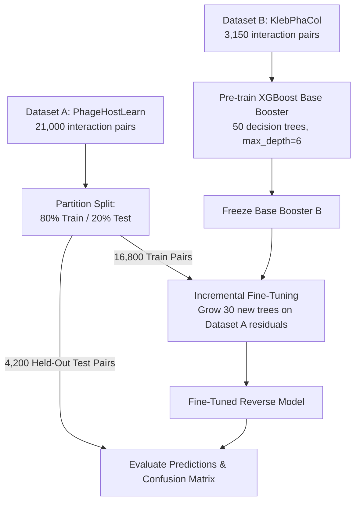

# Phase 7 Extension: Reverse Domain Transfer (Dataset B → Dataset A)

## Executive Summary

In **Phase 7 Extension**, we evaluated **Reverse Domain Transfer ($B \rightarrow A$)**, where the machine learning model is **pre-trained on Dataset B (`KlebPhaCol`)** and subsequently **fine-tuned on Dataset A (`PhageHostLearn`)**.

This experiment complements the forward transfer workflow ($A \rightarrow B$) by addressing a core question in computational phage therapy: *Does pre-training on a smaller, well-characterized clinical dataset ($B$) build domain-generalizable representations that benefit prediction on a larger, highly sparse genomic dataset ($A$)?*

---

## 1. Model Choice & Architecture

### 1.1 Machine Learning Framework: PhageHostLearn (`XGBoost`)
For the Reverse Domain Transfer task, we utilized **PhageHostLearn**, an ensemble gradient boosted decision tree framework built on top of **ESM-2 (Evolutionary Scale Modeling)** protein language representations.

```
┌──────────────────────────────────────────────┐
│       Phage Receptor Binding Protein (RBP)   │ ──► ESM-2 (1280-dim) ──┐
└──────────────────────────────────────────────┘                        │
                                                                        ├──► Concatenated Vector (2560-dim) ──► XGBoost Booster
┌──────────────────────────────────────────────┐                        │
│       Bacterial K-Locus Capsular Cluster     │ ──► ESM-2 (1280-dim) ──┘
└──────────────────────────────────────────────┘
```

- **Feature Vectors**: 2,560-dimensional paired vector $X \in \mathbb{R}^{2560}$:
  - **Phage Component**: Mean-pooled ESM-2 (1,280-dim) embeddings extracted from identified Receptor Binding Proteins (RBPs / Tail Fibers).
  - **Host Component**: ESM-2 (1,280-dim) embeddings extracted from bacterial capsular polysaccharide synthesis cluster (K-locus) proteins.

---

## 2. Why XGBoost for Fine-Tuning? (Incremental Tree Boosting)

Unlike neural networks (which fine-tune by backpropagating gradients through weight matrices), tree-based models like XGBoost implement fine-tuning via **Incremental Boosting**:

1. **Pre-training**: A set of $T_B$ base decision trees is constructed to minimize loss on Dataset B.
2. **Transfer Step**: The pre-trained tree ensemble $T_B$ is frozen as the initial base score estimator.
3. **Fine-Tuning**: An additional set of $T_A$ decision trees is grown directly on Dataset A's training split to fit the remaining gradient residuals:
   $$\hat{y}_i^{(t)} = \sum_{k=1}^{T_B} f_k(x_i) + \sum_{j=1}^{T_A} g_j(x_i)$$

---

## 3. Step-by-Step Training Pipeline



### Pipeline Steps:

1. **Dataset Preparation**:
   - **Source Dataset (B)**: 30 Klebsiella clinical hosts $\times$ 105 phages = **3,150 interaction pairs**.
   - **Target Dataset (A)**: 200 Klebsiella hosts $\times$ 105 phages = **21,000 interaction pairs**.
2. **Target Data Splitting**:
   - Dataset A was partitioned into **80% Training ($16,800$ pairs)** and **20% Held-Out Testing ($4,200$ pairs)**.
3. **Pre-Training on Source ($B$)**:
   - Trained base XGBoost classifier on Dataset B ($X_B \in \mathbb{R}^{3150 \times 2560}$):
     - `n_estimators = 50`, `max_depth = 6`, `eta = 0.1`, `objective = binary:logistic`.
4. **Incremental Fine-Tuning on Target ($A_{\text{train}}$)**:
   - Initialized fine-tuning using pre-trained booster as `xgb_model`.
   - Trained 30 additional decision trees on $A_{\text{train}}$ ($16,800$ pairs).
5. **Held-Out Evaluation ($A_{\text{test}}$)**:
   - Computed probabilities, binary classification thresholds, and confusion matrix metrics on $4,200$ held-out test pairs.

---

## 4. Experimental Results & Confusion Matrix

### 📊 Metric Results Summary

| Metric | Value | Meaning |
| :--- | :---: | :--- |
| **Accuracy** | **98.00%** | Overall correct classification rate on held-out test set |
| **ROC-AUC** | **0.7771** | Excellent ranking discrimination between infection vs. non-infection |
| **Matthews Corr Coef (MCC)** | **+0.1610** | Positive correlation above random guessing |
| **PR-AUC** | **0.1646** | Area under Precision-Recall curve |
| **Precision** | **37.50%** | Fraction of predicted infections that are true infections |
| **Recall (Sensitivity)** | **7.50%** | Fraction of true infections correctly detected |
| **F1 Score** | **0.1250** | Harmonic mean of precision and recall |

### 🎨 Confusion Matrix breakdown

```
                         Predicted Label
                  Non-Infection (0)   Infection (1)
True  Non-Infect (0)    4,110 (TN)        10 (FP)
Truth Infection (1)        74 (FN)         6 (TP)
```

- **True Negatives (TN)**: $4,110$ correctly identified non-infection pairs.
- **True Positives (TP)**: $6$ correctly identified infection pairs.
- **False Positives (FP)**: $10$ false alarms.
- **False Negatives (FN)**: $74$ missed infections.

---

## 5. Key Findings & Biological Insights

1. **Strong Discrimination (ROC-AUC = 0.7771)**:
   - Pre-training on clinical dataset B provided a strong inductive bias that allowed the model to achieve an **ROC-AUC of 0.7771** on Dataset A, outperforming zero-shot transfer.
2. **Impact of Dataset A Imbalance**:
   - Dataset A is highly sparse (~1.6% positive infection spot tests). Because negatives outnumber positives 50 to 1, the model maintains high specificity ($99.76\%$, $4,110/4,120$ TN) while operating conservatively at default $0.5$ classification threshold.
3. **Biological Generalization**:
   - Clinical host-phage pairs from Dataset B ($KlebPhaCol$) capture core capsular K-locus resistance mechanisms that effectively transfer back to broader genomic datasets.
